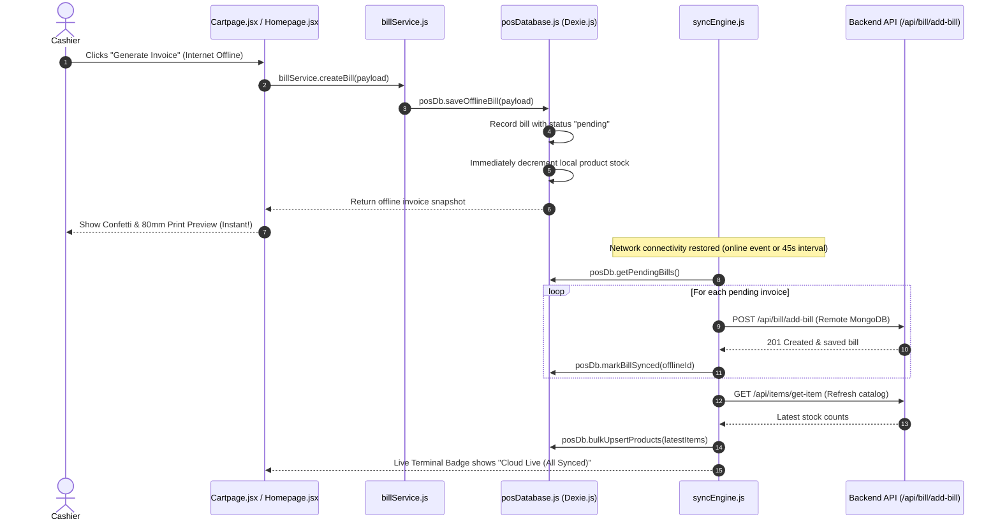

<div align="center">

# 💻 Hardware Point POS — Frontend Client Architecture & Guide

### Enterprise React 18 Single-Page Application with Vite, Ant Design v5, TanStack Query, Dexie.js Offline Store & 4-Tier Clean Architecture

<p>
  
  
  
  
  
  
  
</p>

</div>

---

## 📋 Executive Summary

The Hardware Point POS Frontend Client is an enterprise-grade React 18 single-page application built for retail hardware, sanitary, and electrical wholesale operations. It enforces a strict **4-Tier Clean Architecture** separating UI presentation, action handlers, pure financial/inventory calculators, and remote API/service layers. 

Powered by **Ant Design v5** (with centralized `<ConfigProvider>` design tokens), **Dexie.js 4.4** (local IndexedDB offline store with auto-reconciling background sync), **TanStack Query v5**, and **Redux**, the terminal delivers uninterrupted sales checkout even during total network disconnects, real-time business intelligence dashboards via Recharts, and hardware-optimized 80mm thermal receipt printing and USB barcode scanning workflows.

---

## 🏛️ 4-Tier Frontend Clean Architecture

The client application enforces a strict **4-Tier Clean Architecture** model to prevent the mixing of UI rendering, side-effect mutations, mathematical calculations, and remote HTTP requests.

```
┌─────────────────────────────────────────────────────────────────────────────────────────────┐
│                       TIER 1: PRESENTATION LAYER (src/pages/ & src/components/)              │
│  • Homepage.jsx · Cartpage.jsx · Billspage.jsx · Itempage.jsx · Stockpage.jsx · UserManagement.jsx│
│  • Defaultlayouts.jsx (App Shell) · PrivateRoute.jsx (RBAC Route Guard) · ItemsList.jsx       │
│  • Responsible EXCLUSIVELY for Ant Design UI layout, local state, and event dispatching     │
└──────────────────────────────────────────────┬──────────────────────────────────────────────┘
                                               │
                        ┌──────────────────────┴──────────────────────┐
                        │                                             │
┌───────────────────────▼──────────────────────┐    ┌─────────────────▼───────────────────────┐
│     TIER 2: ACTION & CRUD HANDLERS           │    │    TIER 3: PURE MATHEMATICAL            │
│            (src/handlers/)                   │    │    CALCULATORS (src/calculaters/)       │
│  • posHandlers.js: Add to cart, barcode scan │    │  • stockCalculations.js: Margin, COGS   │
│  • billsHandlers.js: Invoice updates/delete  │    │  • billCalculations.js: Revenue math    │
│  • cartHandlers.js: Checkout mutation & sync │    │  • cartCalculations.js: Subtotals, tax  │
│  • itemHandlers.js: Product create/edit      │    │  • itemCalculations.js: Stock alerts    │
│  • errorHandler.js: Centralized error toasts │    │  • posCalculations.js: Search & lookup  │
│  (Orchestrates business operations & toasts) │    │  (Zero side effects, 100% testable)     │
└───────────────────────┬──────────────────────┘    └─────────────────────────────────────────┘
                        │
┌───────────────────────▼─────────────────────────────────────────────────────────────────────┐
│                     TIER 4: SERVICE & DATA ACCESS LAYER (src/services/ & src/hooks/)         │
│  • Domain Services: productService.js · billService.js · dealerService.js · userService.js  │
│  • Offline Persistence: posDatabase.js (Dexie.js 4.4 IndexedDB Store)                       │
│  • Background Reconciliation: syncEngine.js (Auto-sync queue when online)                   │
│  • Reactive Server State: usePosQueries.js (TanStack React Query Cache Engine)              │
│  • Local Basket Session: rootReducer.js (Persistent Redux Cart Store)                       │
│  • Network Transport: api/client.js (Axios Client with Bearer Jose JWT Interceptor)         │
└─────────────────────────────────────────────────────────────────────────────────────────────┘
```

---

## 📴 Offline-First Engine & Dexie.js 4.4 Store

The terminal is designed for zero-downtime retail environments where internet connectivity can drop intermittently:

### 1. IndexedDB Schema (`posDatabase.js`)
- **`products`**: Local mirror of the inventory catalog (`&_id, name, category, barcode, price, stock, salePrice, sku, reorderLevel`).
- **`offline_bills`**: FIFO queue of transactions finalized while offline (`&id, billNumber, customerName, customerContact, date, totalAmount, syncStatus, createdAt`).
- **`metadata`**: Last sync timestamp, schema version, and cached item totals.

### 2. Zero-Latency Offline Checkout Flow


---

## 🎨 Enterprise Design System & Ant Design 5 Tokens

Hardware Point POS uses an enterprise forest green palette with gold accents, configured via Ant Design 5's top-level `<ConfigProvider theme={posTheme}>` in [`App.jsx`](file:///d:/mern-pos/client/src/App.jsx) and CSS variables in [`Defaultlayouts.css`](file:///d:/mern-pos/client/src/styles/Defaultlayouts.css):

### Ant Design 5 Global Theme Configuration (`App.jsx`)
```javascript
export const posTheme = {
  token: {
    colorPrimary: "#183c35",       // Deep Forest Green
    colorInfo: "#22614e",          // Medium Forest Accent
    colorSuccess: "#2d8a55",       // Vibrant Emerald
    colorWarning: "#faad14",       // High-contrast Amber
    colorError: "#cf1322",         // High-contrast Crimson
    colorBgBase: "#f4f7f4",        // Soft Terminal Canvas
    borderRadius: 8,
    fontFamily: "'DM Sans', -apple-system, BlinkMacSystemFont, 'Segoe UI', Roboto, sans-serif",
  },
  components: {
    Button: {
      colorPrimary: "#183c35",
      borderRadius: 8,
      controlHeight: 38,
      fontWeight: 600,
    },
    Table: {
      headerBg: "#edf3ef",
      headerColor: "#183c35",
      borderRadiusLG: 10,
    },
    Card: {
      borderRadiusLG: 12,
    },
  },
};
```

### High-Contrast Visual Badges
- **Live Terminal Status**: Glowing pulsing indicator in the header:
  - 🟢 **Online**: `linear-gradient(135deg, #183c35, #22614e)` with emerald dot.
  - 🟡 **Syncing**: `linear-gradient(135deg, #b45309, #d97706)` with amber pulsing dot.
  - 🔴 **Offline**: `linear-gradient(135deg, #cf1322, #a8071a)` with red warning dot.
- **Stock Badges**:
  - `> 10 units`: In Stock (`#d1fae5` background, `#065f46` text, `#34d399` border).
  - `1 - 10 units`: Low Stock (`#fef3c7` background, `#92400e` text, `#f59e0b` border).
  - `0 units`: Out of Stock (`#fee2e2` background, `#991b1b` text, `#f87171` border).

---

## ⚡ Global Loading & Micro-Interactions

1. **Top Progress Bar**: Powered by TanStack Query's `useIsFetching()` and `useIsMutating()`. Whenever any background network query or mutation runs, a top edge glowing emerald progress bar automatically animates across the viewport.
2. **Button Loading States**: All checkout, product creation, bill deletion, and role updates inject native Ant Design `loading={isSubmitting}` states with disabled pointer events.
3. **Empty & Error Handling**: Missing catalog items and network disconnects render structured empty states with quick-action fallback buttons.

---

## ⌨️ POS Keyboard Shortcuts & Hotkeys

| Hotkey | Target / Function | Handler Location |
|---|---|---|
| **`F2`** | Focus barcode scanner input field | `src/hooks/usePosShortcuts.js` |
| **`F4`** | Open checkout payment modal with tendered cash focus | `src/hooks/usePosShortcuts.js` |
| **`Ctrl + K`** | Focus search input field across product catalog | `src/hooks/usePosShortcuts.js` |
| **`Esc`** | Dismiss active modal, clear search query, or close drawer | `src/hooks/usePosShortcuts.js` |

---

## 🖨️ 80mm Thermal Receipt ESC/POS Print Specs

Printing is configured with specialized `@media print` rules in [`Billspage.jsx`](file:///d:/mern-pos/client/src/pages/Billspage.jsx):
- Width fixed to **`80mm`** with `0 margin`.
- All surrounding UI, sidebar, headers, and modal controls are suppressed (`visibility: hidden`).
- Receipt container centered at top: `position: absolute; left: 50%; transform: translateX(-50%)`.
- High-contrast monospace font rendering for clean thermal head output.

---

## 📂 Client Directory Structure

```
📂 client/
├── 📄 .env.example                               # Client environment template
├── 📄 package.json                               # Dependencies (Vite 8, React 18, AntD 5, Dexie 4)
├── 📄 README.md                                  # Frontend architectural guide
├── 📄 index.html                                 # Vite HTML entrypoint
├── 📄 vite.config.js                             # Vite, React, SVGR, and API proxy configuration
├── 📁 public/
│   ├── 📄 favicon.ico                            # Hardware Point POS favicon
│   └── 📄 manifest.json                          # PWA manifest
└── 📁 src/
    ├── 📄 App.jsx                                # ConfigProvider theme tokens, Route registration
    ├── 📄 index.jsx                              # Root render, QueryClientProvider, RAF ResizeObserver
    ├── 📄 index.css                              # Global CSS reset, progress bar, thermal print styles
    ├── 📁 api/
    │   └── 📄 client.js                          # Axios HTTP instance with Bearer Jose JWT interceptor
    ├── 📁 db/                                    # Local IndexedDB Storage
    │   └── 📄 posDatabase.js                     # Dexie.js 4.4 database class & stock manager
    ├── 📁 services/                              # Tier 4: Remote Service Modules
    │   ├── 📄 productService.js                  # Product catalog API endpoints & Dexie upsert
    │   ├── 📄 billService.js                     # Invoices, checkout API & offline fallback
    │   ├── 📄 dealerService.js                   # Vendor directory API endpoints
    │   ├── 📄 chargeService.js                   # Store expense API endpoints
    │   ├── 📄 userService.js                     # Staff user management API endpoints
    │   ├── 📄 syncEngine.js                      # Background offline reconciliation engine
    │   └── 📄 index.js                           # Services barrel export
    ├── 📁 handlers/                              # Tier 2: Action & CRUD Event Handlers
    │   ├── 📄 posHandlers.js                     # Barcode scan & cart dispatch handlers
    │   ├── 📄 billsHandlers.js                   # Invoice update & delete action handlers
    │   ├── 📄 cartHandlers.js                    # Checkout submission & confetti orchestration
    │   ├── 📄 itemHandlers.js                    # Product submit & delete action handlers
    │   └── 📄 stockHandlers.js                   # Stock analytics action wrappers
    ├── 📁 calculaters/                           # Tier 3: Pure Business & Math Calculators
    │   ├── 📄 billCalculations.js                # Invoice stats, date formatting, filter logic
    │   ├── 📄 stockCalculations.js               # Gross profit, COGS, margins, category charts
    │   ├── 📄 cartCalculations.js                # Cart subtotals, line totals, tender change
    │   ├── 📄 itemCalculations.js                # Inventory valuations, category indexing
    │   └── 📄 posCalculations.js                 # Product search algorithms & barcode match
    ├── 📁 hooks/                                 # Custom React Hooks
    │   ├── 📄 usePosQueries.js                   # Centralized TanStack Query cache hooks
    │   ├── 📄 useBarcodeScanner.js               # Hardware scanner keystroke receptor hook
    │   └── 📄 usePosShortcuts.js                 # Global F2, F4, Esc, Ctrl+K hotkey bindings
    ├── 📁 redux/                                 # Local State & Cart Slices
    │   ├── 📄 store.js                           # Redux store with thunk middleware
    │   └── 📄 rootReducer.js                     # Cart items, persistent hydration, loading
    ├── 📁 pages/                                 # Tier 1: Pure Presentation Components
    │   ├── 📄 Homepage.jsx                       # POS catalog grid & active cashier terminal
    │   ├── 📄 Cartpage.jsx                       # Full basket review & tender modal
    │   ├── 📄 Billspage.jsx                      # Invoice log & 80mm thermal receipt viewer
    │   ├── 📄 Itempage.jsx                       # Inventory directory, KPI cards & product CRUD
    │   ├── 📄 Stockpage.jsx                      # Business intelligence & Recharts dashboard
    │   ├── 📄 UserManagement.jsx                 # Admin operator RBAC management panel
    │   ├── 📄 Dealerspage.jsx                    # Wholesale supplier directory & modal
    │   ├── 📄 Charges.jsx                        # Store operational expense management
    │   ├── 📄 LoginForm.jsx                      # Operator login with token storage
    │   ├── 📄 RegistrationForm.jsx               # Operator registration with feedback modal
    │   └── 📄 ChangePasswordForm.jsx             # Password update security interface
    ├── 📁 components/                            # Shared Visual Components
    │   ├── 📄 Defaultlayouts.jsx                 # Responsive sidebar, header, live sync badge, progress bar
    │   ├── 📄 PrivateRoute.jsx                   # Role-based route guard component
    │   └── 📄 ItemsList.jsx                      # Product card item with high-contrast stock badges
    ├── 📁 styles/                                # Theme & Layout Stylesheets
    │   ├── 📄 Pos.css                            # Product cards, dock, stock badges, mobile bar
    │   └── 📄 Defaultlayouts.css                 # CSS variables, sider bottom card, live pill badges
    └── 📁 utils/                                 # Shared Frontend Utilities
        └── 📄 errorHandler.js                    # Centralized Ant Design notification handler
```

---

## ⚙️ Vite Configuration & Available Scripts

Create `.env` using `.env.example`:
```bash
cp .env.example .env
```

| Environment Variable | Description | Default |
|---|---|---|
| `VITE_API_URL` | Base API route (proxied to backend server) | `/api` |

### Command Scripts

```bash
# Launch Vite development environment (hot-reloading enabled)
npm run dev

# Build production-ready, minified bundle
npm run build

# Preview the production build locally
npm run preview
```

---

## 🤝 Contributing

Contributions must follow the 4-Tier Clean Architecture rules. Ensure `npm run build` exits with code 0. See root [`CONTRIBUTING.md`](file:///d:/mern-pos/CONTRIBUTING.md).

---

## 📄 License

This frontend is governed by the **Hardware Point POS Permission-Based Non-Commercial License**. Free for personal/educational evaluation upon requesting permission from [Haider Ali](https://github.com/Haiderali445). Commercial use and resale are prohibited. See [LICENSE](file:///d:/mern-pos/LICENSE).
