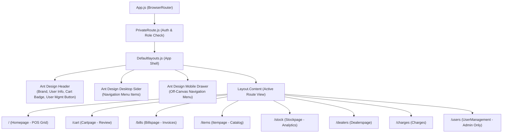
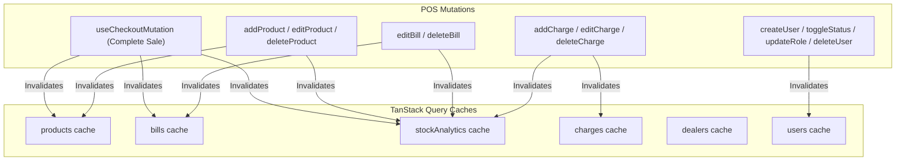
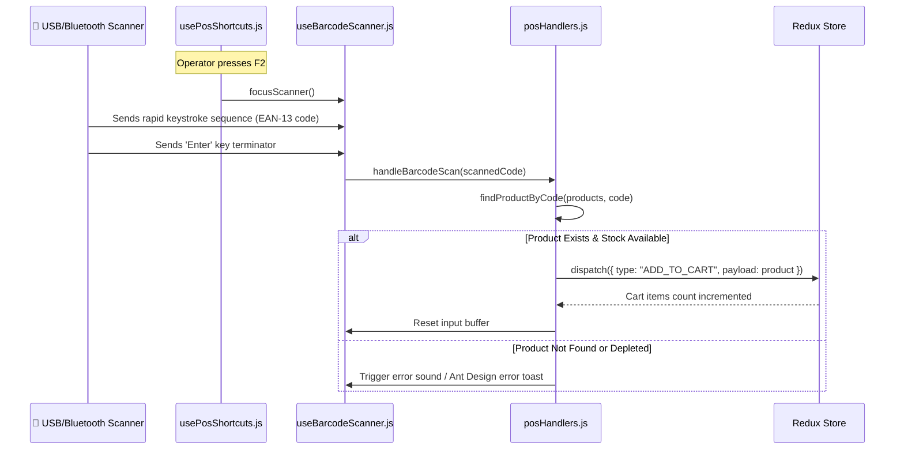

<div align="center">

# 💻 Hardware Point POS — Frontend Client Architecture & Guide

### Enterprise React 18 Single-Page Application with Ant Design v5, TanStack Query & 4-Tier Clean Architecture

<p>
  
  
  
  
  
  
</p>

</div>

---

## 🏛️ 4-Tier Frontend Clean Architecture

The client application enforces a strict **4-Tier Clean Architecture** model to prevent the mixing of UI rendering, side-effect mutations, mathematical calculations, and remote HTTP requests.

```
┌─────────────────────────────────────────────────────────────────────────────────────────────┐
│                       TIER 1: PRESENTATION LAYER (src/pages/ & src/components/)              │
│  • Homepage.js · Cartpage.js · Billspage.js · Itempage.js · Stockpage.js · UserManagement.js│
│  • Defaultlayouts.js (App Shell) · PrivateRoute.js (RBAC Route Guard)                       │
│  • Responsible EXCLUSIVELY for Ant Design UI layout, local state, and event dispatching     │
└──────────────────────────────────────────────┬──────────────────────────────────────────────┘
                                               │
                        ┌──────────────────────┴──────────────────────┐
                        │                                             │
┌───────────────────────▼──────────────────────┐    ┌─────────────────▼───────────────────────┐
│     TIER 2: ACTION & CRUD HANDLERS           │    │    TIER 3: PURE MATHEMATICAL            │
│            (src/handlers/)                   │    │    CALCULATORS (src/calculaters/)       │
│  • posHandlers.js: Add to cart, barcode scan │    │  • stockCalculations.js: Margin, COGS   │
│  • billsHandlers.js: Invoice updates/delete  │    │  • billCalculations.js: Revenue math    │
│  • cartHandlers.js: Checkout mutation        │    │  • cartCalculations.js: Subtotals, tax  │
│  • itemHandlers.js: Product create/edit      │    │  • itemCalculations.js: Stock alerts    │
│  • errorHandler.js: Centralized error toasts │    │  • posCalculations.js: Search & lookup  │
│  (Orchestrates business operations & toasts) │    │  (Zero side effects, 100% testable)     │
└───────────────────────┬──────────────────────┘    └─────────────────────────────────────────┘
                        │
┌───────────────────────▼─────────────────────────────────────────────────────────────────────┐
│                     TIER 4: SERVICE & DATA ACCESS LAYER (src/services/ & src/hooks/)         │
│  • Domain Services: productService.js · billService.js · dealerService.js · userService.js  │
│  • State Synchronization: usePosQueries.js (TanStack React Query Cache Engine)              │
│  • Client Session: rootReducer.js (Persistent Redux Cart Store)                             │
│  • Transport: api/client.js (Axios Client with Bearer JWT Token Interceptor)                │
└─────────────────────────────────────────────────────────────────────────────────────────────┘
```

---

## 📊 Mermaid Architectural Diagrams

### 1. 4-Tier Frontend Dataflow & Decoupling

```mermaid
graph TD
    subgraph Presentation["Tier 1: Presentation Layer"]
        Page["React Page Component\n(e.g., Stockpage.js)"]
    end

    subgraph Calculators["Tier 3: Pure Calculators"]
        Calc["stockCalculations.js\ncalculateFinancialMetrics()"]
    end

    subgraph Handlers["Tier 2: Action Handlers"]
        Handler["stockHandlers.js\nAction Dispatcher"]
        ErrUtil["errorHandler.js\nnotifyError() & notifySuccess()"]
    end

    subgraph DataAccess["Tier 4: Service & Data Access"]
        Query["usePosQueries.js\nuseProducts() & useBills()"]
        Svc["productService.js & billService.js"]
        Axios["api/client.js\nBearer Token Interceptor"]
    end

    Page -->|"Observes reactive query data"| Query
    Query -->|"Calls API abstractions"| Svc
    Svc -->|"Executes HTTP requests"| Axios
    Page -->|"Passes raw data for computation"| Calc
    Calc -->>|"Returns pure KPI metrics"| Page
    Page -->|"Dispatches user submit/delete"| Handler
    Handler -->|"Calls service mutations"| Svc
    Handler -->|"Intercepts exceptions"| ErrUtil
    ErrUtil -->>|"Renders uniform toast"| Page
```

---

### 2. Component Layout & RBAC Shell Hierarchy



---

### 3. TanStack Query Cache Invalidation Dependency Graph



---

### 4. Barcode Hardware Scanner Keystroke Loop



---

## 📂 Client Directory Structure

```
📂 client/
├── 📄 .env.example                               # Client environment template
├── 📄 package.json                               # Dependencies & scripts
├── 📄 README.md                                  # Frontend architectural guide
├── 📁 public/
│   ├── 📄 favicon.ico                            # Hardware Point POS favicon
│   ├── 📄 index.html                             # Single Page Application HTML shell
│   └── 📄 manifest.json                          # PWA manifest
└── 📁 src/
    ├── 📄 App.js                                 # Route registration & role protection
    ├── 📄 index.js                               # Root render, QueryClientProvider, RAF ResizeObserver
    ├── 📄 index.css                              # Base typography & thermal receipt print styles
    ├── 📁 api/
    │   └── 📄 client.js                          # Axios HTTP instance with Bearer JWT interceptor
    ├── 📁 services/                              # Tier 4: Remote Service Modules
    │   ├── 📄 productService.js                  # Product catalog API endpoints
    │   ├── 📄 billService.js                     # Invoices & checkout API endpoints
    │   ├── 📄 dealerService.js                   # Vendor directory API endpoints
    │   ├── 📄 chargeService.js                   # Store expense API endpoints
    │   ├── 📄 userService.js                     # Staff user management API endpoints
    │   └── 📄 index.js                           # Services barrel export
    ├── 📁 handlers/                              # Tier 2: Action & CRUD Event Handlers
    │   ├── 📄 posHandlers.js                     # Barcode scan & cart dispatch handlers
    │   ├── 📄 billsHandlers.js                   # Invoice update & delete action handlers
    │   ├── 📄 cartHandlers.js                    # Checkout submission & confetti orchestration
    │   ├── 📄 itemHandlers.js                    # Product submit & delete action handlers
    │   └── 📄 stockHandlers.js                   # Stock analytics action wrappers
    ├── 📁 calculaters/                           # Tier 3: Pure Business & Math Calculators
    │   ├── 📄 billCalculations.js                # Invoice stats, date formatting, filter logic
    │   ├── 📄 stockCalculations.js               # Gross profit, COGS, margins, category charts
    │   ├── 📄 cartCalculations.js                # Cart subtotals, line totals, tender change
    │   ├── 📄 itemCalculations.js                # Inventory valuations, category indexing
    │   └── 📄 posCalculations.js                 # Product search algorithms & barcode match
    ├── 📁 hooks/                                 # Custom React Hooks
    │   ├── 📄 usePosQueries.js                   # Centralized TanStack Query cache hooks
    │   ├── 📄 useBarcodeScanner.js               # Hardware scanner keystroke receptor hook
    │   └── 📄 usePosShortcuts.js                 # Global F2, F4, Esc, Ctrl+K hotkey bindings
    ├── 📁 redux/                                 # Local State & Cart Slices
    │   ├── 📄 store.js                           # Redux store with thunk middleware
    │   └── 📄 rootReducer.js                     # Cart items, persistent hydration, loading
    ├── 📁 pages/                                 # Tier 1: Pure Presentation Components
    │   ├── 📄 Homepage.js                        # POS catalog grid & active cashier terminal
    │   ├── 📄 Cartpage.js                        # Full basket review & tender modal
    │   ├── 📄 Billspage.js                       # Invoice log & 80mm thermal receipt viewer
    │   ├── 📄 Itempage.js                        # Inventory directory & product modal CRUD
    │   ├── 📄 Stockpage.js                       # Business intelligence & Recharts dashboard
    │   ├── 📄 UserManagement.js                  # Admin operator RBAC management panel
    │   ├── 📄 Dealerspage.js                     # Wholesale supplier directory & modal
    │   ├── 📄 Charges.js                         # Store operational expense management
    │   ├── 📄 LoginForm.js                       # Operator login with token storage
    │   └── 📄 ChangePasswordForm.js              # Password update security interface
    ├── 📁 components/                            # Shared Visual Components
    │   ├── 📄 Defaultlayouts.js                  # Responsive sidebar, header, mobile drawer
    │   ├── 📄 PrivateRoute.js                    # Role-based route guard component
    │   └── 📄 ItemsList.js                       # Reusable product card item
    ├── 📁 styles/                                # Theme & Layout Stylesheets
    │   ├── 📄 Pos.css                            # Product cards, dock, mobile floating bar
    │   └── 📄 Defaultlayouts.css                 # CSS variables, responsive breakpoints
    └── 📁 utils/                                 # Shared Frontend Utilities
        └── 📄 errorHandler.js                    # Centralized Ant Design notification handler
```

---

## 🎨 Design System & CSS Variables

Custom design tokens are maintained in [`client/src/styles/Defaultlayouts.css`](file:///d:/mern-pos/client/src/styles/Defaultlayouts.css):

```css
:root {
  --primary-color: #183c35;       /* Deep Forest Green */
  --primary-light: #22614e;       /* Medium Forest Accent */
  --secondary-color: #f2c14e;     /* Warm Gold / Highlight */
  --accent-green: #2d8a55;        /* Success Emerald */
  --bg-color: #f4f7f4;            /* Soft Terminal Canvas */
  --card-bg: #ffffff;             /* Crisp Card Surface */
  --text-primary: #183c35;        /* Primary Slate */
  --text-secondary: #6e7d75;      /* Subtitle Grey */
  --border-radius: 12px;          /* Smooth Corner Curves */
  --transition: all 0.25s ease;   /* Fluid Animations */
}
```

---

## ⌨️ POS Keyboard Shortcuts & Hotkeys

| Hotkey | Target / Function | Handler Location |
|---|---|---|
| **`F2`** | Focus barcode scanner input field | `src/hooks/usePosShortcuts.js` |
| **`F4`** | Open checkout payment modal with tendered cash focus | `src/hooks/usePosShortcuts.js` |
| **`Ctrl + K`** | Focus search input field across product catalog | `src/hooks/usePosShortcuts.js` |
| **`Esc`** | Dismiss active modal, clear search query, or close drawer | `src/hooks/usePosShortcuts.js` |

---

## 🖨️ 80mm Thermal Receipt ESC/POS Print Specs

Printing is configured with specialized `@media print` rules in [`Billspage.js`](file:///d:/mern-pos/client/src/pages/Billspage.js):
- Width fixed to **`80mm`** with `0 margin`.
- All surrounding UI, sidebar, headers, and modal controls are suppressed (`visibility: hidden`).
- Receipt container centered at top: `position: absolute; left: 50%; transform: translateX(-50%)`.
- High-contrast monospace font rendering for clean thermal head output.

---

## ⚙️ Configuration & Available Scripts

Create `.env` using `.env.example`:
```bash
cp .env.example .env
```

| Environment Variable | Description |
|---|---|
| `PORT=3000` | Local React development server port |
| `REACT_APP_API_URL=/api` | Base API route (proxied via `package.json` to `http://localhost:8080`) |

### Command Scripts

```bash
# Launch development environment (hot-reloading enabled)
npm start

# Run unit tests with Jest runner
npm test

# Build production-ready, minified bundle
npm run build
```

---

## 🤝 Contributing

Contributions must follow the 4-Tier Clean Architecture rules. Ensure `npm run build` exits with code 0. See root [`CONTRIBUTING.md`](file:///d:/mern-pos/CONTRIBUTING.md).

---

## 📄 License

This frontend is governed by the **Hardware Point POS Permission-Based Non-Commercial License**. Free for personal/educational evaluation upon requesting permission from [Haider Ali](https://github.com/Haiderali445). Commercial use and resale are prohibited. See [LICENSE](file:///d:/mern-pos/LICENSE).
